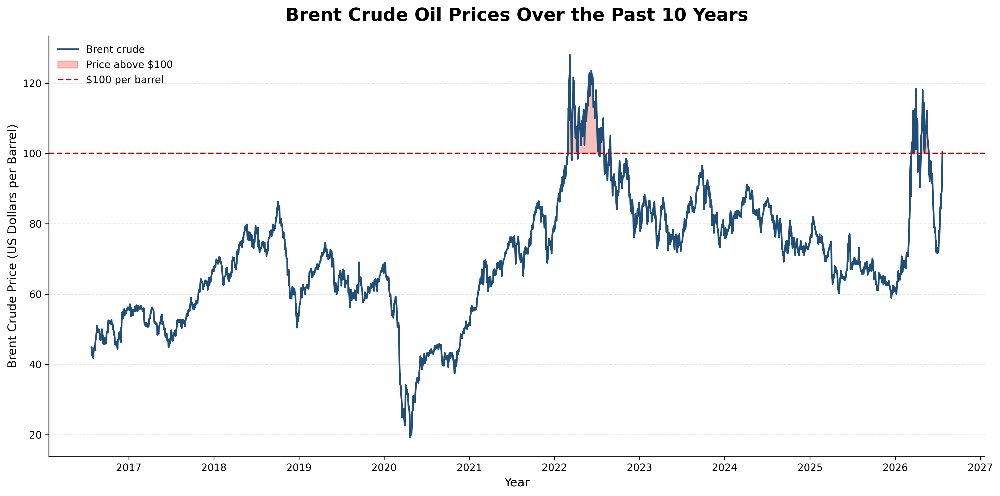
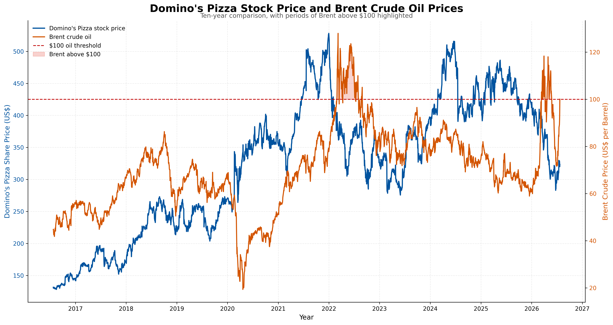
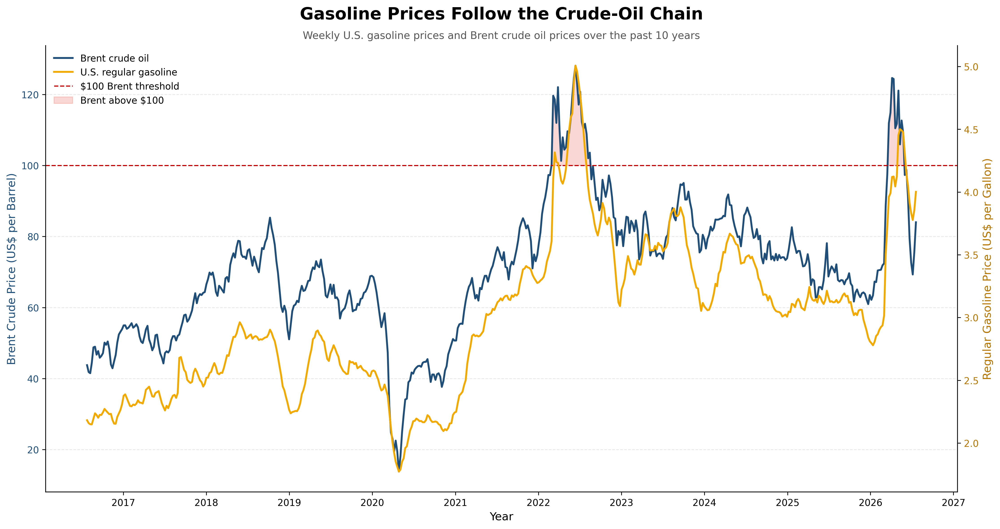

# Oil-Price Market Analysis

This project contains the code and selected figures behind an Economics Weekly analysis of oil-price transmission. It moves from the crude benchmark itself to two downstream questions: how oil relates to gasoline prices and how energy costs can interact with an individual company’s operating environment.

## Analysis included

- Front-month WTI crude futures over a rolling ten-year period
- Brent crude futures and periods above $100 per barrel
- Domino’s adjusted share price compared with Brent
- Weekly Brent spot prices compared with U.S. regular gasoline prices

## Data sources

- Yahoo Finance: WTI futures (`CL=F`), Brent futures (`BZ=F`), and Domino’s Pizza (`DPZ`)
- [FRED DCOILBRENTEU](https://fred.stlouisfed.org/series/DCOILBRENTEU): Europe Brent spot price
- [FRED GASREGW](https://fred.stlouisfed.org/series/GASREGW): U.S. regular gasoline price

The notebook uses rolling ten-year windows ending on the date it is run. Later executions may therefore differ from the committed figures.

## Repository contents

```text
oil-price-article/
├── notebooks/
│   └── oil_price_visuals.ipynb
├── outputs/
│   ├── brent_crude_above_100.png
│   ├── dominos_stock_vs_brent_oil_10_years.png
│   └── gasoline_vs_brent_crude_10_years.png
├── README.md
└── requirements.txt
```

Running the notebook also generates `wti_crude_oil_10_years.png`.

## Reproduce the analysis

```powershell
py -m venv .venv
.venv\Scripts\Activate.ps1
python -m pip install --upgrade pip
python -m pip install -r requirements.txt
```

Open `notebooks/oil_price_visuals.ipynb` in VS Code or Jupyter and run the cells in order.

## Selected figures

### Brent above $100 per barrel



### Domino’s and Brent crude



### Gasoline and Brent crude



## Limitations

Front-month futures differ from physical spot markets and can be affected by contract rolling. The company comparison is descriptive, not causal, and dual-axis charts should be interpreted cautiously.

This project is provided for research and educational purposes only. It is not investment advice.
