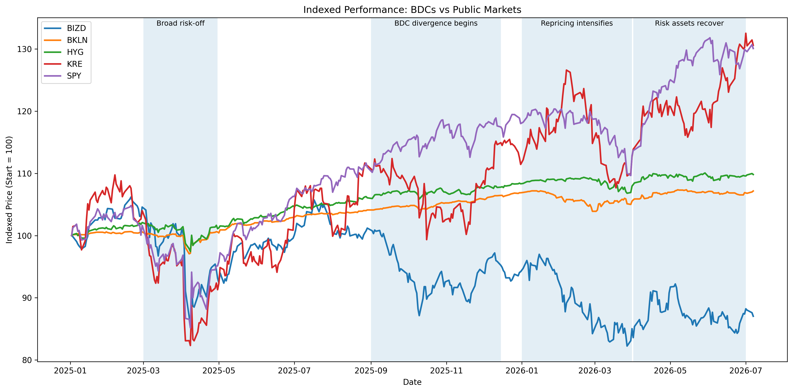
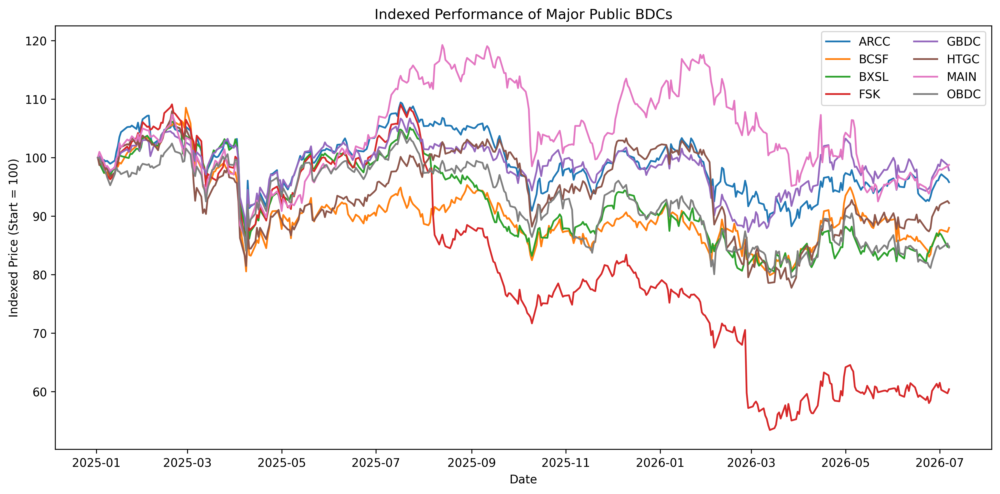
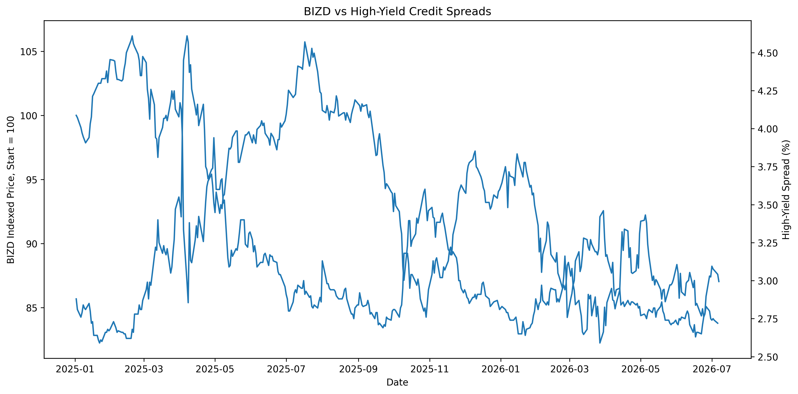

# Private-Credit Market Analysis

This project contains the code and selected figures behind an Economics Weekly analysis of publicly traded private-credit proxies. It compares the BIZD business development company ETF with broader markets, studies dispersion across major listed BDCs, and evaluates whether weakness in FSK reflected a sector-wide move or company-specific divergence.

## Research questions

- Did public BDCs weaken alongside equities and traditional credit, or diverge from them?
- How widely did returns vary across major BDCs?
- Were BDC drawdowns and volatility unusually severe relative to public-market benchmarks?
- Did high-yield credit spreads confirm the stress visible in BDC prices?
- How far did FSK deviate from an equal-weight peer basket excluding FSK?

## Data

Market prices are downloaded through `yfinance`. The analysis includes:

- **BDC exposure:** BIZD
- **Market benchmarks:** SPY, HYG, BKLN, and KRE
- **BDC peer group:** ARCC, OBDC, FSK, BXSL, GBDC, MAIN, HTGC, and BCSF
- **Credit conditions:** ICE BofA U.S. High Yield Index option-adjusted spread (`BAMLH0A0HYM2`) from [FRED](https://fred.stlouisfed.org/series/BAMLH0A0HYM2)

The main market comparison begins on January 1, 2025. Because the notebook downloads data through the current date, a future rerun may not exactly match the committed figures.

## Repository contents

```text
private-credit-article/
├── notebooks/
│   └── private_credit_visuals.ipynb
├── outputs/
│   ├── chart_1_bizd_vs_public_markets.png
│   ├── chart_1_marked_zones.png
│   ├── chart_2_bdc_total_return_ranking.png
│   ├── chart_2_fsk_deviation_from_peer_basket.png
│   ├── chart_2_fsk_vs_peer_basket_ex_fsk.png
│   ├── chart_2_individual_bdc_performance.png
│   ├── chart_2_marked_zones.png
│   ├── chart_3_drawdown_gap_all_in_one_with_markers.png
│   ├── chart_3_drawdowns.png
│   ├── chart_4_bizd_vs_high_yield_spreads.png
│   └── chart_5_rolling_volatility.png
├── README.md
└── requirements.txt
```

## Reproduce the analysis

Create and activate a virtual environment:

```powershell
py -m venv .venv
.venv\Scripts\Activate.ps1
```

Install the focused dependency set:

```powershell
python -m pip install --upgrade pip
python -m pip install -r requirements.txt
```

Open `notebooks/private_credit_visuals.ipynb` in VS Code or Jupyter and run the cells in order. Figures are written to `outputs/`.

## Selected figures

### BDCs versus broader markets



### Performance across major public BDCs



### BIZD and high-yield credit spreads



## Limitations

Listed BDCs are public-market proxies, not direct measurements of the entire private-credit market. Their prices reflect liquidity, leverage, portfolio mix, management, dividends, and investor sentiment. The analysis is descriptive and does not establish causation.

This project is provided for research and educational purposes only. It is not investment advice.
