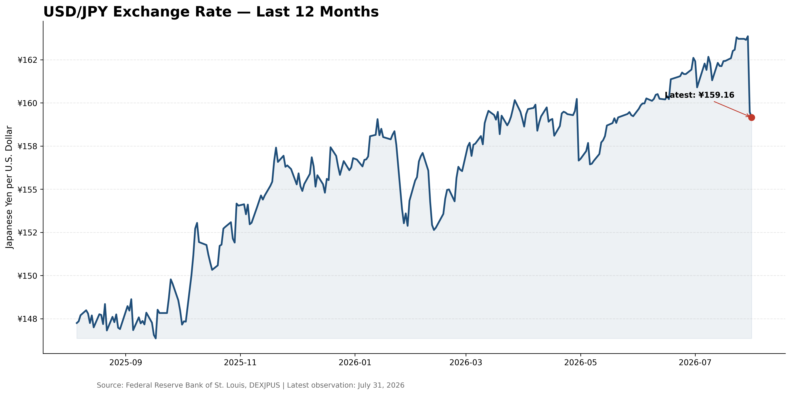

# Yen-Intervention Market Analysis

This project contains the USD/JPY visual analysis supporting an Economics Weekly examination of yen weakness, intervention, and the risk of a carry-trade unwind.

## Analysis included

- A rolling ten-year USD/JPY chart for long-run context
- A rolling twelve-month chart focused on the latest currency move
- Clear interpretation of the quotation: a higher USD/JPY rate means more yen are required to buy one U.S. dollar and therefore indicates yen depreciation

## Data source

Both charts use [FRED DEXJPUS](https://fred.stlouisfed.org/series/DEXJPUS), the Japanese-yen-per-U.S.-dollar exchange-rate series.

The notebook downloads observations through the date it is run. Later executions may differ from the committed figure.

## Repository contents

```text
yen-intervention-article/
├── notebooks/
│   └── yen_intervention_visuals.ipynb
├── outputs/
│   └── usd_jpy_last_12_months.png
├── README.md
└── requirements.txt
```

Running the notebook also generates `usd_jpy_10_years.png`.

## Reproduce the analysis

```powershell
py -m venv .venv
.venv\Scripts\Activate.ps1
python -m pip install --upgrade pip
python -m pip install -r requirements.txt
```

Open `notebooks/yen_intervention_visuals.ipynb` in VS Code or Jupyter and run the cells in order.

## Selected figure



## Limitations

Exchange-rate movement alone does not prove intervention. A complete event analysis should also use official Ministry of Finance transaction disclosures, policy announcements, positioning data, and contemporaneous reporting.

This project is provided for research and educational purposes only. It is not investment advice.
